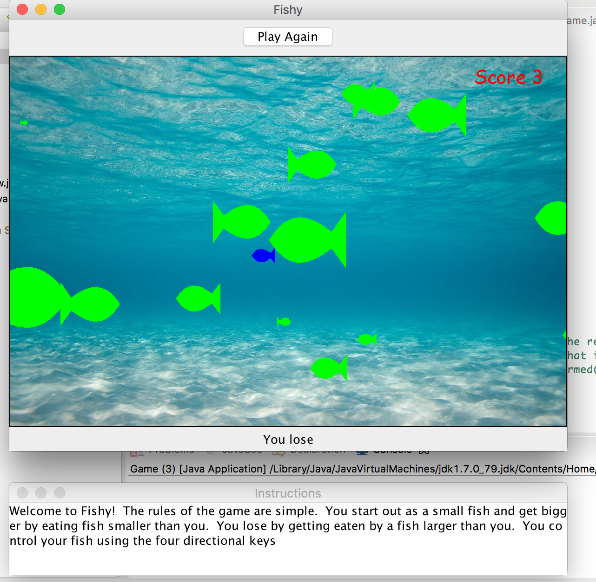

# Fishy

I created this game as part of the final project of my programming lang & tech I class in my junior year.  Starter code that initialized the game window was provided to us.  From there we had the freedom to design and implement any game that we were interested in creating.  The purpose was to give us an opportunity to implement our knowledge of object oriented programming and the datastructures we learned in the class.  This game was programmed in java.

I decided to create the game fishy, which I played as a kid.  Premise is simple.  You start out as a small fish and get bigger if you "eat" smaller fish but lose if a bigger fish eats you.  You win by growing to a certain size via eating the smaller fish swimming around you.

To play the game, run the game.java file.  In the case that music and background aren't coming through, move background1.wav, burp.wav, and water.jpg to the root folder.

